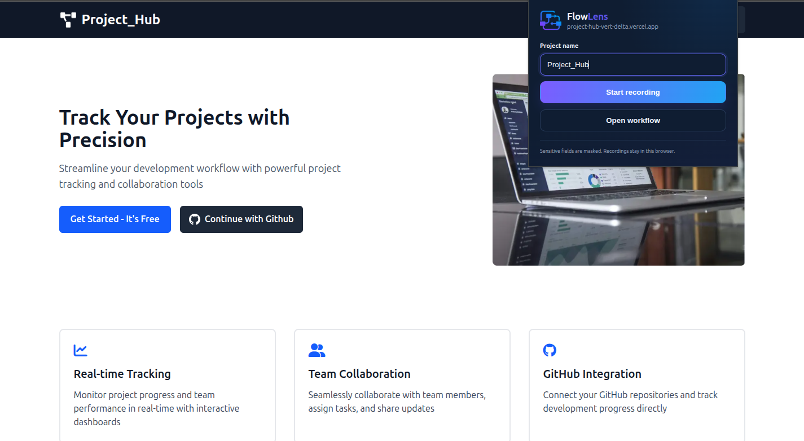
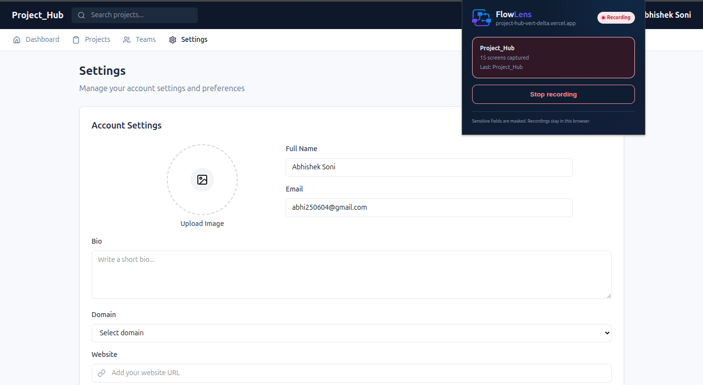
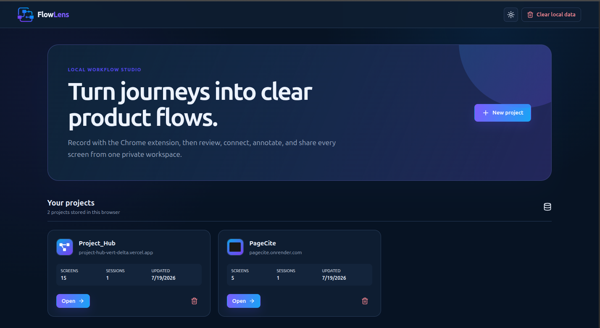
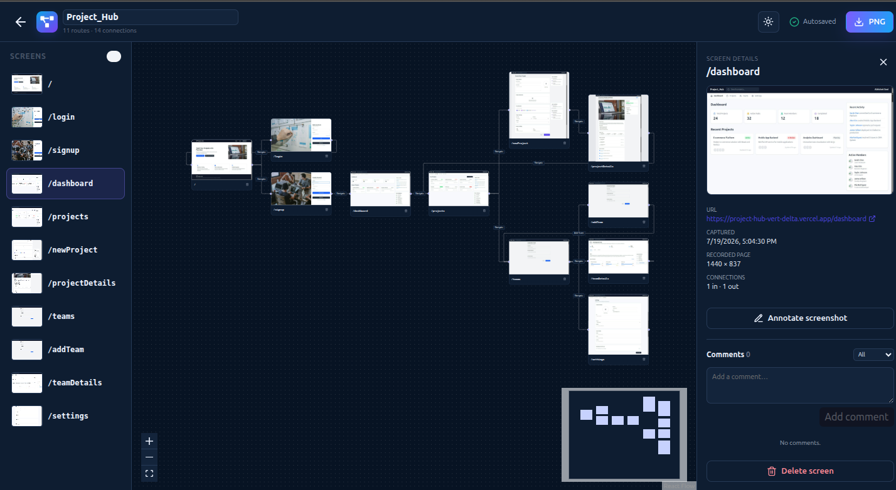
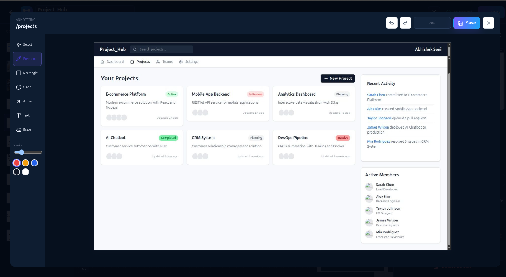

# FlowLens

FlowLens is a local-first Chrome extension and workflow whiteboard for recording guided website journeys. It captures the visible viewport, records navigation relationships, then imports the session into an editable React Flow canvas with comments, screenshot annotations, and JSON/PNG export.

## Features

- Manifest V3 Chrome extension with initial capture and automatic navigation capture
- Full-page, history API, popstate, hash, back/forward, and SPA route tracking
- Click-context labels, SHA-256 duplicate detection, and clear recording badge
- Temporary masking for password fields and `[data-flowlens-mask]`; omission via `[data-flowlens-ignore]`
- Strict localhost bridge from `chrome.storage.local` to IndexedDB
- React Flow canvas with drag, pan, zoom, minimap, edge editing, and Dagre auto-layout
- Per-screen freehand, arrow, rectangle, circle, text, sticky-note, erase, move, undo, and redo tools
- Local comments with edit, resolve/reopen, delete, and status filters
- Idempotent persistence, project cascade deletion, JSON export, and PNG export

## Screenshots

### Start a Website Recording

Open FlowLens on any website, enter a project name, and start recording the website journey. FlowLens captures the current screen and tracks navigation while keeping recorded data inside the browser.



---

### Active Recording

While recording is active, FlowLens displays the current project, number of captured screens, and the most recently captured page. The recording can be stopped directly from the extension popup.



---

### Homepage

The landing page where users can create or open FlowLens projects and manage previous recording sessions.



---

### Workflow Editor

Automatically generated website workflow displayed as an interactive React Flow canvas. Users can drag screens, edit connections, zoom, pan, and reorganize the navigation graph.



---

### Annotation Workspace

Annotate screenshots with freehand drawings, arrows, comments, and text to communicate UI changes with developers and stakeholders.




## Technology

React, TypeScript, Vite, Chrome Manifest V3 APIs, React Flow, Dagre, Zustand, Dexie/IndexedDB, Zod, html-to-image, Vitest, Testing Library, and Playwright.

## Quick start

Requires Node.js 20 or newer and Chrome/Chromium.

```bash
npm install
npm run dev:web
```

In another terminal:

```bash
npm run build:extension
```

Open `chrome://extensions`, enable Developer mode, choose **Load unpacked**, and select `apps/extension/dist`. Keep `http://localhost:5173` running while recording.

## Commands

| Command                           | Purpose                                                    |
| --------------------------------- | ---------------------------------------------------------- |
| `npm run dev` / `npm run dev:web` | Start the editor on port 5173                              |
| `npm run dev:extension`           | Run CRXJS HMR on port 5174; load `apps/extension/dist-dev` |
| `npm run build`                   | Build all workspaces                                       |
| `npm run build:web`               | Build the web editor                                       |
| `npm run build:extension`         | Build the unpacked extension                               |
| `npm test`                        | Run unit and component tests                               |
| `npm run test:e2e`                | Run the Playwright workflow test                           |
| `npm run lint`                    | Run ESLint                                                 |
| `npm run format`                  | Format with Prettier                                       |

## Repository

```text
apps/extension  Manifest V3 recorder, content scripts, popup, options, and bridge
apps/web        Dashboard, workflow editor, IndexedDB, annotations, and exports
packages/shared Shared types, Zod schemas, constants, and utilities
docs            Setup, usage, architecture, troubleshooting, and privacy guides
data            Original product specification
```

## Known limitations

- Captures only the visible viewport; Chrome internal pages cannot be captured.
- Cross-origin iframe content cannot be inspected or selectively masked.
- UI changes without a URL change are not captured automatically in this MVP.
- Screenshot-heavy projects can reach browser extension storage quotas.
- The PNG action exports the currently rendered workflow viewport.
- One local user, no cloud sync, no live collaboration, no autonomous crawl.

## Roadmap

Future versions may add full-page capture, grouping/search, presentation mode, cloud collaboration, version history, autonomous crawling, AI-assisted naming, and issue/design-tool integrations. These are intentionally outside this MVP.

See [Setup](docs/SETUP.md), [Usage](docs/USAGE.md), [Architecture](docs/ARCHITECTURE.md), [Troubleshooting](docs/TROUBLESHOOTING.md), and [Privacy](docs/PRIVACY.md).
