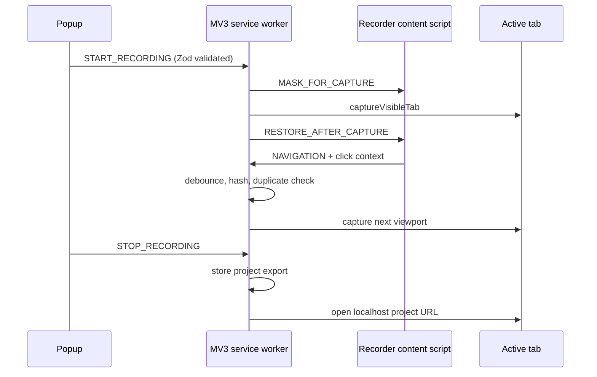
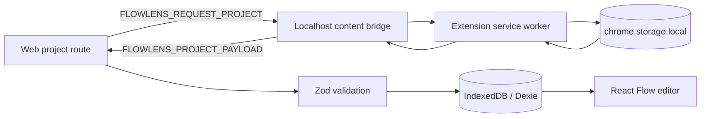

# Architecture

FlowLens is an npm-workspace monorepo. Shared TypeScript entities, validation, URL normalization, hashing, and connection utilities live in `packages/shared` and are consumed directly by both apps.

## Extension

- **Popup:** reads recording state, starts/captures/stops sessions, reports errors, and opens workflows.
- **Service worker:** owns state, captures with `chrome.tabs.captureVisibleTab`, hashes screenshots, creates edges, atomically moves completed recordings into the export store, and opens the editor.
- **Recorder content script:** patches history methods, listens to popstate/hash/click events, masks sensitive elements, and renders the recording badge.
- **Tab listener:** catches full-document navigation and closed recorded tabs.
- **Localhost bridge:** accepts one Zod-validated request from the exact allowed web origin, asks the service worker for the export, then posts a validated payload back.
- **Options:** stores the editor URL in `chrome.storage.sync`.

## Import and persistence

Dexie version 1 defines projects, sessions, screens, connections, comments, annotations, and canvas states. Import uses `put`/`bulkPut`, making repeat imports idempotent. Project deletion runs as one transaction and deletes every related entity. Zustand holds ephemeral selection, modal, and toast state; durable data stays in IndexedDB.

## Workflow and annotations

React Flow renders custom screenshot nodes and smooth-step edges. Dagre computes a left-to-right layout only when no saved positions exist or when the user requests it. Node drag completion saves positions. Annotation elements are stored as structured local records and rendered over the captured screenshot in a per-screen canvas; an optional JPEG preview is stored with the record.

## Security decisions

The build uses no remote scripts, `eval`, analytics, cookies, network inspection, or screenshot upload. The web app makes no API calls. The content bridge checks both `event.origin` and `event.source`, uses a fixed localhost target, and validates cross-context messages. `activeTab`, `tabs`, `storage`, and `scripting` support guided recording; `unlimitedStorage` prevents long local screenshot sessions from failing at Chrome's small default extension quota. The only explicit host permission is the local bridge. Static recorder content scripts are needed to observe user-guided navigation. Password values, form values, cookies, headers, local storage, session storage, and network traffic are never read.
